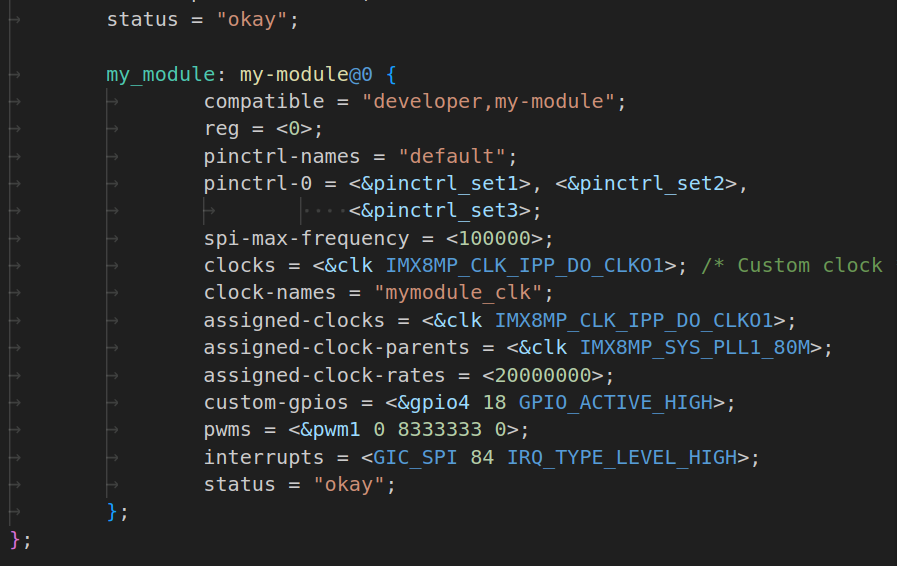

# DeviceTree Language Support for Visual Studio Code

More than just a syntax highlighter for DeviceTree files in VSCode.

## Features

### Syntax Highlighting

This extension provides comprehensive syntax highlighting for Device Tree Source (DTS) files, including:

- **Comments**: Line comments (`//`) and block comments (`/* */`)
- **Preprocessor directives**: `#include` statements with file paths
- **Node definitions**: Node names, labels, and addresses (`label: node@address { }`)
- **Properties**: Cell arrays (`<...>`) with references, numbers, and constants
- **Data types**:
  - Strings (`"compatible"`, `"okay"`, ...)
  - Numbers (decimal `100000`, ...)
  - Node references (`&pinctrl_set1`, `&pinctrl_set2`, ...)
  - Constants (`IMX8MP_CLK_IPP_DO_CLKO1`, `IMX8MP_SYS_PLL1_80M`, ...)

*Example of Device Tree file with syntax highlighting enabled*

#### Supported File Extensions

- `.dts` - Device Tree Source files
- `.dtsi` - Device Tree Source Include files
- `.dtso` - Device Tree Source Overlays files

## Installation

Install this extension from the [Visual Studio Code Marketplace](https://marketplace.visualstudio.com/items?itemName=devicetree) or by searching for "DeviceTree" in the Extensions panel (`Ctrl+Shift+X`).

## Commands

### `DeviceTree: Hello World`
Displays a welcome message (placeholder command for future DeviceTree functionality).

### `DeviceTree: Validate Syntax` *(Coming Soon)*
Validates DeviceTree syntax and highlights errors.

### `DeviceTree: Format Document` *(Coming Soon)*
Formats DeviceTree files according to standard conventions.

## Development and Testing

### For Users
- The extension automatically activates when you open DeviceTree files (`.dts`, `.dtsi`, `.dtso`)
- Syntax highlighting is applied immediately
- Access commands via Command Palette (`Ctrl+Shift+P` / `Cmd+Shift+P`)

### For Developers
- Press `F5` to open a new Extension Development Host window
- Open DeviceTree files to test syntax highlighting
- Set breakpoints in `src/extension.ts` for debugging
- View extension output in the Debug Console

## Contributing

We welcome contributions! Please see [CONTRIBUTING.md](CONTRIBUTING.md) for guidelines.

### Reporting Issues
- Use the [GitHub Issues](https://github.com/andy9a9/vscode-devicetree/issues) page
- Include your VS Code version, extension version, and sample DeviceTree files
- Describe expected vs actual behavior

### Feature Requests
- Check existing issues before creating new ones
- Describe the use case and expected functionality
- Include examples of DeviceTree syntax that should be supported

## License

MIT
